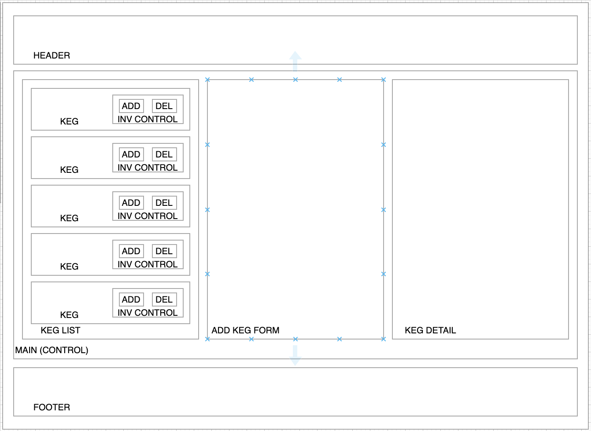

# POWDER KEG

#### A React application for an explosive fireworks popup

#### By Jonathan Stull

## **Table of Contents**

 

* <a href="#about-the-POWDER-KEG">About the POWDER KEG</a>
    * <a href="#technologies-used">Technologies Used</a>
* <a href="#Component-Architecture">Component Architecture</a>
* <a href="#Set-Up-instructions">Set Up Instructions</a>
* <a href="#known-bugs">Known Bugs</a>
* <a href="#License">License</a>
* <a href="#Acknowledgements">Acknowledgements</a>
* <a href="#Contact-Information">Contact Information</a>

 

### About the POWDER KEG

 

POWDER KEG is a popup purveyor of fine explosives. This application helps the fine POWDER KEG folks keep everything under the POWDER KEG tent under POWDER KEG control&mdash;contained, if you will. That means tracking inventory to make sure something strange doesn't just pop off into thin air.

With this application, users and inventory managers can see list/menu of all available kegs. Each keg lists its name, brand, price per unit, price per keg, quantity, and type (e.g., M-80, sparkler, smoke bomb, etc.). Users can submit a form to add a new keg to a list and click on a keg to see its detail page, where a detail view displays how many fireworks are left in each keg. (The quantity of fireworks in each keg will vary.) Users can also click a button next to a keg whenever a firework is sold.

 

## Component Architecture

## Technologies Used

 

- React with Redux
- VS Code

 

## Setup Instructions

### Prerequisites

 

- A text editor like [VS Code](https://code.visualstudio.com/)

 

### Installation

 

1. Clone repository: `git clone https://github.com/mountainfawkes/powder-keg.git`.
2. Navigate to the `/powder-keg` directory
3. Open with your preferred text editor to view the code base

 

- #### **Run the Program**

 

1. Nagivate to project folder using `cd /powder-keg`
2. `npm install` to install dependencies.
3. `npm start` to run application server
4. Open http://localhost:3000/ in your preferred browser

 

### Known Bugs

 

* None (yet [fingers crossed])

 

### License

 

Copyright (c) 2021 by [Jonathan Stull](https://github.com/jonathanstull)

Permission is hereby granted, free of charge, to any person obtaining a copy of this software and associated documentation files (the "Software"), to deal in the Software without restriction, including without limitation the rights to use, copy, modify, merge, publish, distribute, sublicense, and/or sell copies of the Software, and to permit persons to whom the Software is furnished to do so, subject to the following conditions:

The above copyright notice and this permission notice shall be included in all copies or substantial portions of the Software.

THE SOFTWARE IS PROVIDED "AS IS", WITHOUT WARRANTY OF ANY KIND, EXPRESS OR IMPLIED, INCLUDING BUT NOT LIMITED TO THE WARRANTIES OF MERCHANTABILITY, FITNESS FOR A PARTICULAR PURPOSE AND NONINFRINGEMENT. IN NO EVENT SHALL THE AUTHORS OR COPYRIGHT HOLDERS BE LIABLE FOR ANY CLAIM.cs, DAMAGES OR OTHER LIABILITY, WHETHER IN AN ACTION OF CONTRACT, TORT OR OTHERWISE, ARISING FROM, OUT OF OR IN CONNECTION WITH THE SOFTWARE OR THE USE OR OTHER DEALINGS IN THE SOFTWARE.

 

## **Acknowledgements**

 

This project was developed alongside the [LearnHowToProgram curriculum](learnhowtoprogram.com) at Epicodus, a coding bootcamp in Portland, Oregon.

This app would not have been possible without [John Edmondson](https://github.com/basicjohn), [Tom Geraghty](https://github.com/Usarneme) and [Jeremy Banka](https://github.com/jeremybanka), whose extensive knowledge and experience in React and design helped me grapple with the basics of state and introduced me to more efficient syntax, inline styling, ternary operators, helpful ES Lint configurations and even (god bless it) an [incredible Arabic typeface](https://yanone.de/). Equally critical to this app was the tutelage of Epicodus instructors [Erik Irgens](https://github.com/erik-t-irgens) and [James Henager](https://github.com/jhenager), whose consistent presence and demos of state and classic RPG victory jingles have been instrumental in keeping the torrid pace of Epicodus managable.

 

#### Contact Information

- Jonathan Stull: jonathan.d.stull@gmail.com
